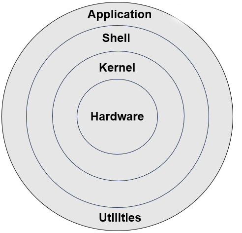
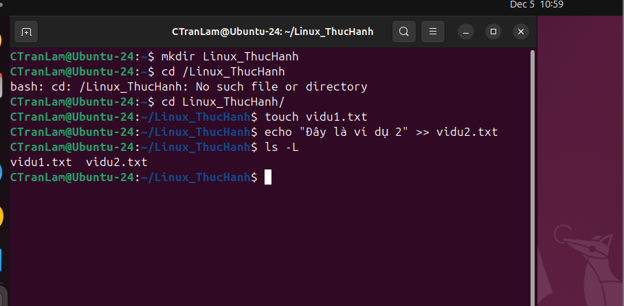
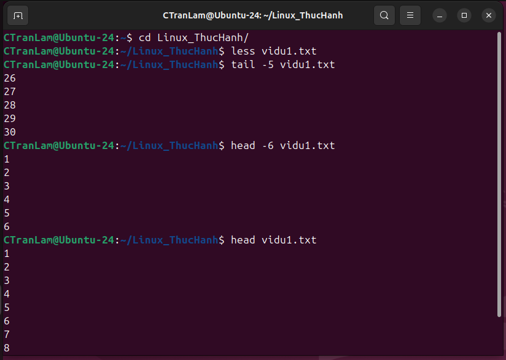
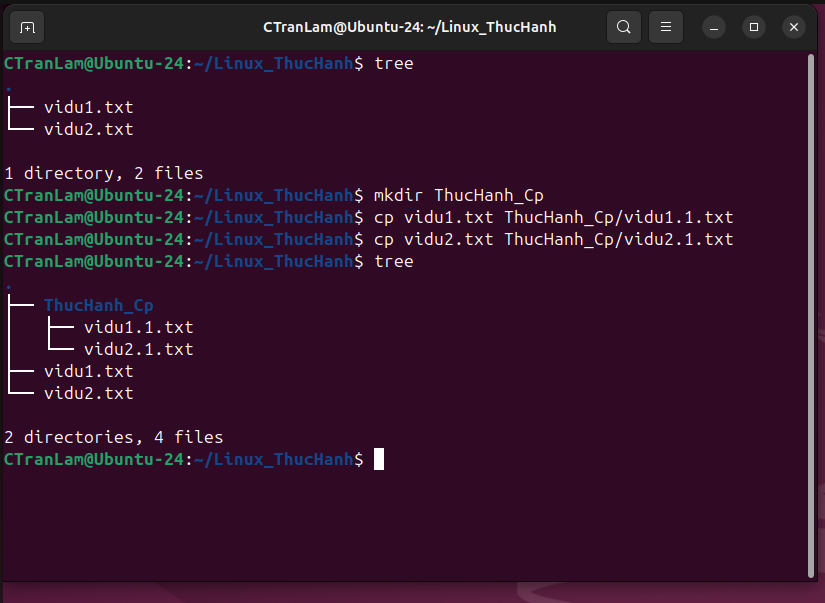

## Training Cloud Week 2

# Phần 1: Giới thiệu tổng quan về Linux
1. Linux là gì?

- Linux là 1 hệ điều hành mã nguồn mở được xây dựng dựa trên Unix. Gồm 3 phần Kernel, Shell và Applications. Trong đó phần Linux Kernel đóng vai trò quan trọng nhất, là thành phần quản lý tài nguyên hệ thống và giao tiếp giữa phần cứng và phần mềm.

- Hệ điều hành mã nguồn mở là:
    - Mã nguồn được công khai, ai cũng có thể xem, sửa đổi và phân phối lại
    - Công đồng phát triển rộng lớn và liên tục cải tiến

- Lịch sử phát triển của Linux:
    - Linux được phát triển bởi Linus Tovalds vào năm 1991 như 1 dự án cá nhân
    - Ban đầu chỉ là kernel, sau đó cộng đồng đóng góp và xây dựng thành 1 hệ điều hành hoàn chỉnh

- Linux Kernel và Linux distribution:
    - Linux kernel: Lõi hệ điều hành(do Linus Torvalds và cộng đồng phát triển)
    - Linux distribution: Xây dựng dựa trên kernel + thêm công cụ quản lý gói, giao diện, tiện ích,...
    - 1 số Linux distributon phổ biến:
        - Ubuntu
        - Debian
        - CentOs
        - Kali Linux

2. Tại sao nên học Linux
- Ứng dụng rộng rãi:
    - Server: 90% server trên thế giới chạy Linux
    - Cloud: AWS, Azure,.. đều sử dụng Linux làm nền
    - DevOps: Docker, Kubernetes, Ansible, Jenkins chạy chủ yếu trên Linux
    - AI/Machine Learning: Môi trường Linux tối ưu cho GPU và thư viện AI
    - Lập trình hệ thống: C/C++/Python thường phát triển chủ yếu trên Linux

- Sự khác biệt giữa Linux và Windows/macOs:
    | `Tiêu chí` | `Linux` | `Window/MacOs`|
    |---------_|-------|-------------|
    | Mã nguồn | Mở    | Đóng        |
    | Chi phí | Miễn phí | Có phí |
    | Bảo mật | Cao | Trung bình |
    | Tùy biến | Rất cao | Ít |
    | Tối ưu Server | Rất tốt | Không tối ưu |
    | Giao diện | Tùy distro | Đồng nhất |

3. Kiến trúc hệ thống 
- Hình ảnh minh họa: 
    

- Linux gồm 3 phần chính:
    - `Kernel`:
        - Là phần quan trọng nhất được ví như trái tim của hệ điều hành, chứa các module, thư viện để quản lý tài nguyên hệ thông như: CPU, RAM, Disk, Process
        - Giao tiếp với phần cứng

    - `Shell`: 
        - Là 1 chương trình thực thi lệnh từ người dùng hoặc từ các ứng dụng yêu cầu chuyển đến cho kernel xử lý
        - Là thành phần nằm giữa Kernel và Application, đóng vai trò trung gian gọi về phía bên dưới và trả dữ liệu lên trên cho Application
        - 1 số loại Shell:
            - Command-line shell : Bash, Zsh.
            - Gui shell : GNOME, KDE.
    
    - `Application`:
        - Các ứng dụng, dịch vụ chạy trên hệ điều hành(web server, database, tool,...)

4. Quá trình khởi động của Linux (Boot process)
    - BIOS/UEFI khởi động.
    - Nạp bootloader (GRUB)
    - Bootloader tìm và nạp Linux kernel vào RAM
    - Kernel kết nối các phân vùng ổ đĩa, gắn chúng vào cây thư mục Linux và khởi tạo hệ thống
    - Khởi chạy tiến trình systemd (PID 1) là tiến trình đầu tiên chạy sau khi kernel khởi động xong, giúp khởi chạy các service, quản lý tiến trình, quản lý log hệ thống,..
    - Load các service và hiển thị màn hình đăng nhập

5. Các thư mục hệ thống chính
    
    | Thư mục | Chức năng |
    |--------|-----------|
    | `/bin` | Chứa các lệnh cơ bản cho user(ls, cp,...) |
    | `/sbin` | Chứa các lệnh quản trị hệ thống |
    | `/etc`  | Chứa file cấu hình hệ thống |
    | `/home` | Thư mục người dùng  |
    | `/root` | Thư mục người dùng root |
    | `/usr`  | Chứa ứng dụng và file dùng chung |
    | `/var`  | Chứa Log và dữ liệu thường xuyên thay đổi |
    | `/tmp`  | Chứa file tạm thời |
    | `/dev`  | Đại diện cho thiết bị(Disk, Usb,...) |

# Phần 2: Làm quen với Terminal và Shell

4.  Terminal & Shell
- `Terminal` là giao diện dòng lệnh (CLI - Command Line Interface) cho phép người dùng nhập lệnh để tương tác với hệ điều hành

- `Shell` là chương trình trung gian giữa người dùng và kernel.
    - Nhiệm vụ:
        - Nhận lệnh từ người dùng
        - Phân tích cú pháp
        - Gửi yêu cầu cho kernel thực thi
        - Trả kết quả lại cho người dùng

    - Các shell phố biến: bash(phổ biến), zsh, fish

5. Lệnh cơ bản trong Linux
    - `pwd` : Hiển thị đường dẫn thư mục hiện tại
    - `ls` : Liệt kê file/thư mục hiện tại
        - `ls -L` : Hiển thị tên danh sách file
        - `ls -l` : Hiển thị danh sách file
        - `ls -a` : Hiển thị tất cả bao gồm cả file ẩn
        - `ls -R` : Hiển thị tất cả các file bên trong thư mục con
    - `cd <Folder>` : Di chuyển vào thư mục
    - `cd ..` : Lùi lại thư mục cha
    - `cd`, `cd ~` : Về thư mục home
    - `clear` : Xóa màn hình terminal
    - `history` : Xem lịch sử các lệnh đã chạy
    - Thực hành: 
        

    - Một số phím tắt:
        - `Ctrl + Alt + T` : Mở terminal
        - `Tab` : Tự động hoàn thành lệnh, tên file hoặc folder
        - `Ctrl + C` : Dừng lệnh đang chạy
        - `Ctrl + D` : Thoát khỏi shell/kết thúc input
        - `Ctrl + L` : Làm sạch màn hình terminal giống clear

6. Cấu trúc đường dẫn
    - Đường dẫn tuyệt đối:
        - Bắt đầu bằng /
        - Tính từ thư mục root
        - Ví dụ: `/home/CTranLam/Documents`, `/etc/ssh/sshd_config`

    - Đường dẫn tương đối:
        - Không bắt đầu bằng /
        - Tính từ thư mục hiện tại
        - Ví dụ: `../Downloads`, `folder1/file.txt`

    - Các ký hiệu đặc biệt:
        - `~` : thư mục home của người dùng hiện tại 
        - `.` : thư mục hiện tại
        - `..` : Lùi lên 1 thư mục cha
        - `$` : Ký hiệu cho biết terminal đang chạy với quyền User bình thường
        - `#` : Terminal đang chạy với quyền Root

    - Minh họa:
        

# Phần 3: Làm việc với file và thư mục
7. Tạo, xem, xóa và di chuyển file
    - Tạo tập tin:
        - Tạo tập tin rỗng sử dụng lệnh `touch`
            ví dụ: `touch data/a.txt`
        - Tạo tập tin với nd txt trong thư mục data sử dụng `echo`
            ví dụ: `echo "Đây là ví dụ" >> data/vidu.txt`

        

    - Xem nội dung file:
        - `cat <tên_file>`: Hiển thị toàn bộ nội dung file
        - `more <tên_file>`: Hiển thị nội dung của tệp tin 1 cách trang trang, sử dụng space để di chuyển lên xuống, q để thoát
        - `less <tên_file>`: Hiển thị nội dung có thể tương tác bằng nút lên xuống
        - `tail <tên_file>`: Hiển thị các dòng cuối của tệp tin
        - `tail -n(số dòng) <tên_file>` : Hiển thị n dòng cuối
        - `head <tên_file>`: Hiển thị các dòng đầu của tệp tin
        - `head -n(số dòng) <tên_file>` : Hiển thị n dòng đầu

        
        
        
    - Sao chép, di chuyển, xóa:
        - `cp <nguồn> <đích>`: Sao chép file.
        - `cp -r <thư mục nguồn> <thư mục đích>` : Sao chép thư mục
        

        - `mv <nguồn> <đích>` : Di chuyển hoặc đổi tên file/thư mục
        - `rm [Options] <file>` : Xóa file
        - `rm -r <thư mục>` : Xóa toàn bộ thư mục
        - `mkdir <thư mục>` : Tạo thư mục mới
        - `rmdir [Options] <thư mục>` : Xóa thư mục rỗng
        - Một số Option như:
            -f: Xóa không cần hỏi
            -i: Hỏi trước khi xóa
            -r: xóa thưu mục chứa nội dung bên trong
        ví dụ: rm -ir ThuMuc2

        

